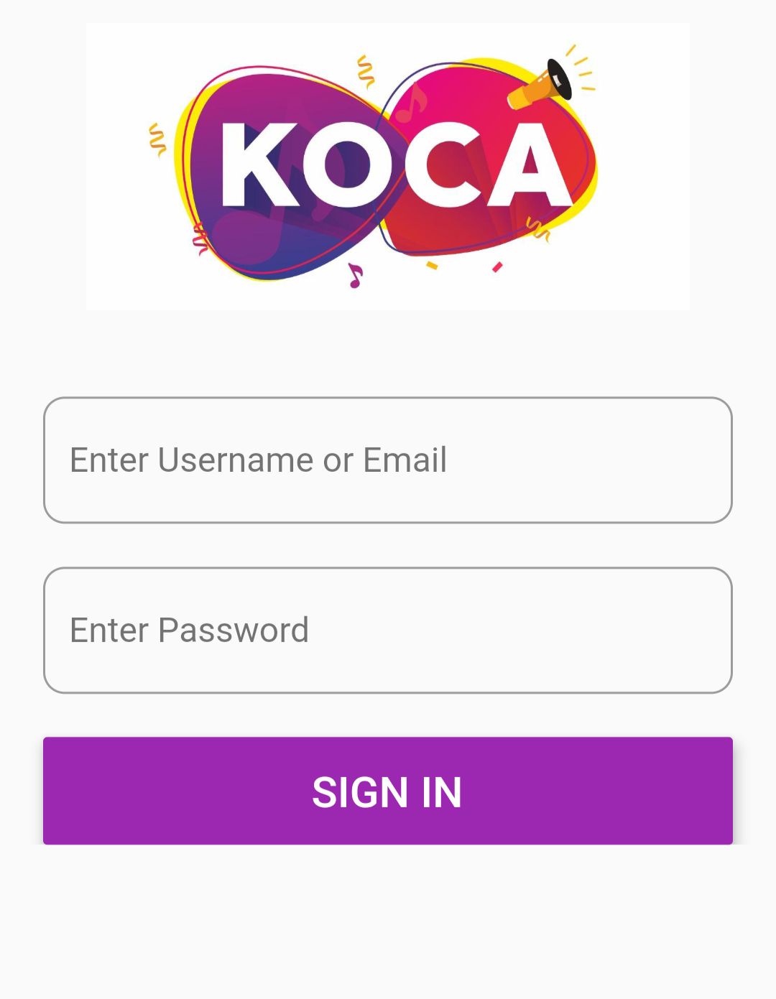
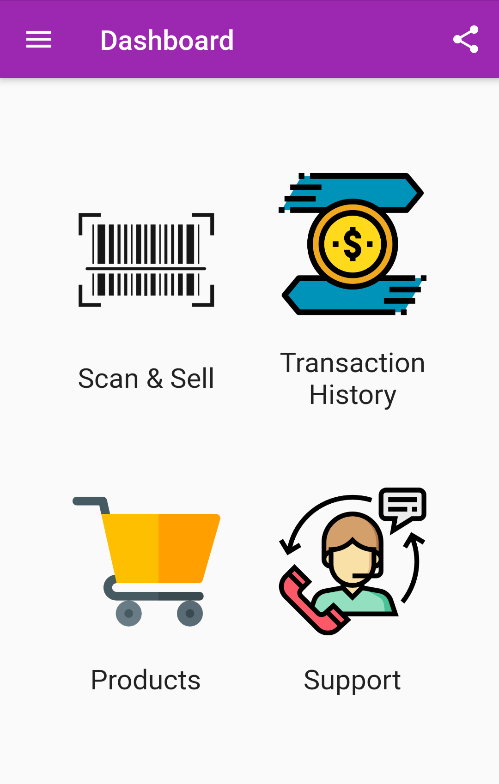
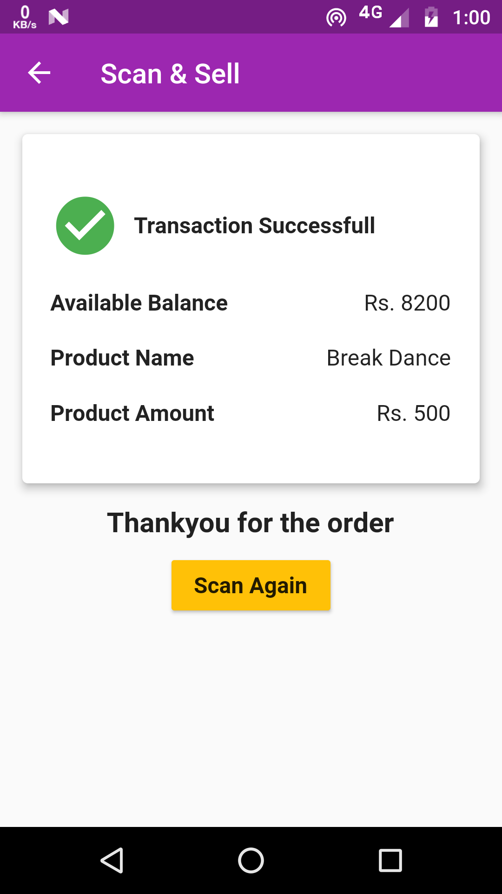
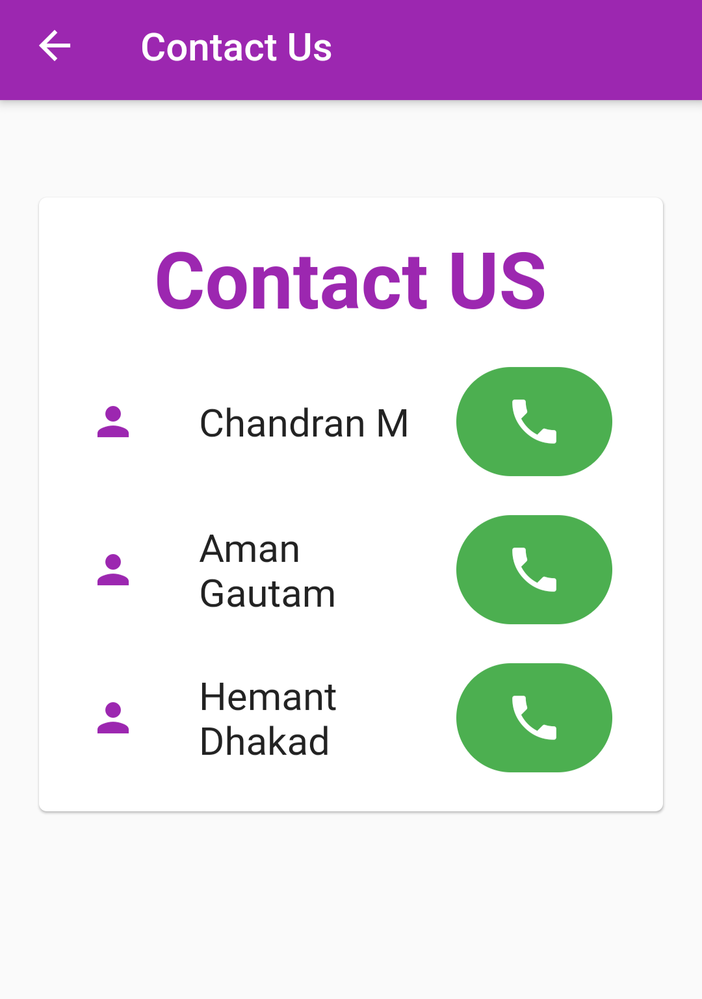

# kota_carniwal2020

* Kota Carniwal is the largest youth festival in Asia, I have developed an Application for the event the application is specifically designed for vendors, for making transactions to students wallet.

* Every Student partipated got an BarCode which they show to vendor and buy product or services from vendor the application uses REST API to make a transaction by the backend.

* Since its specifically designed for the vendors and particular event its not available on Play Store currently.

## Some ScreenShots of App

